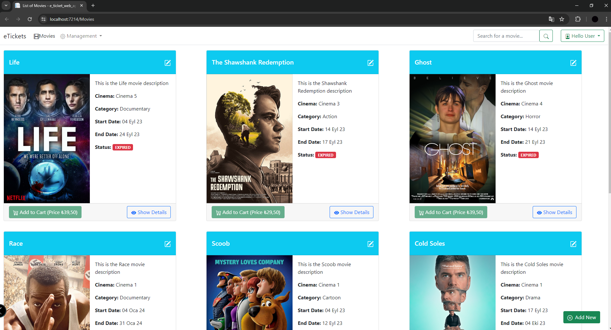
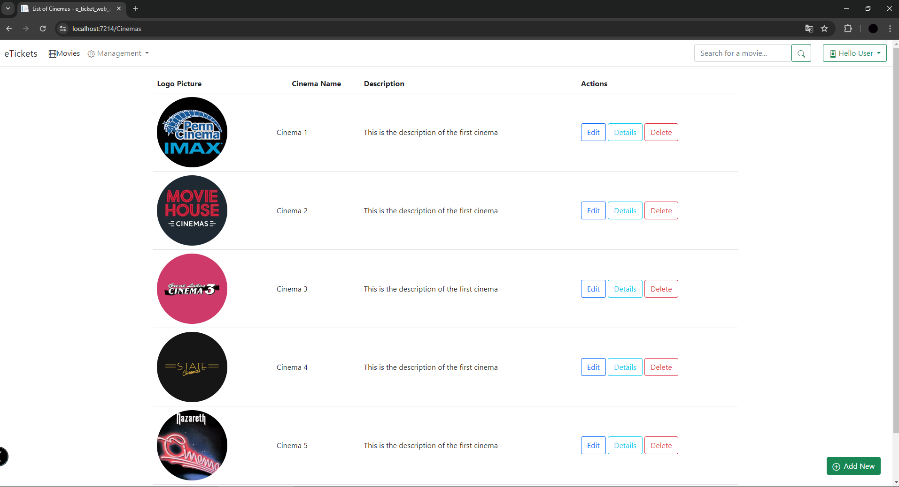
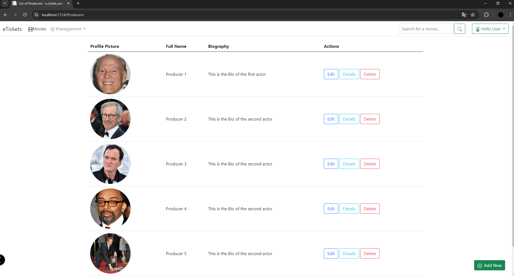
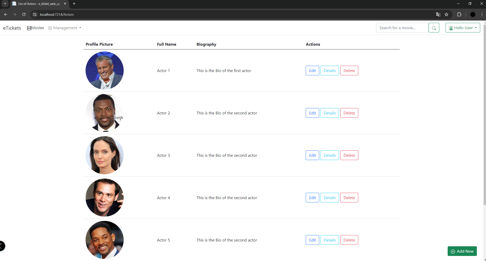
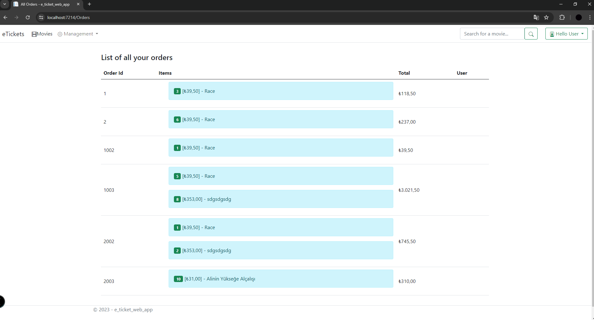
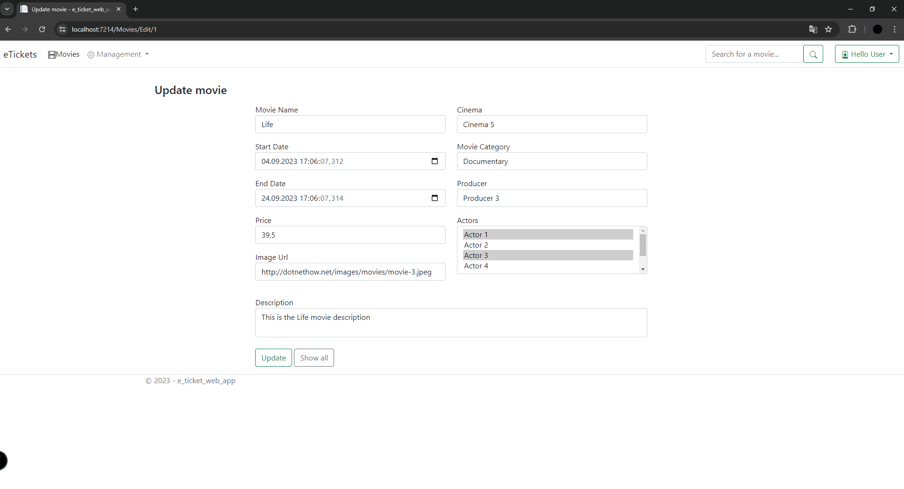
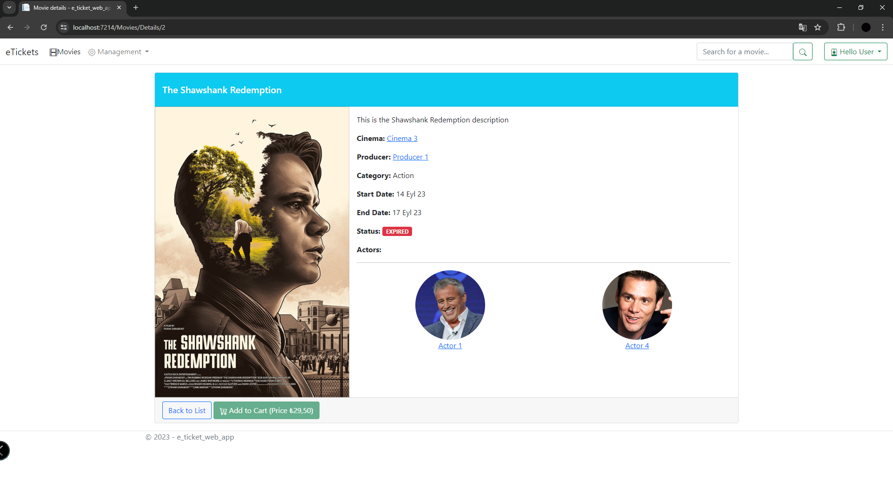
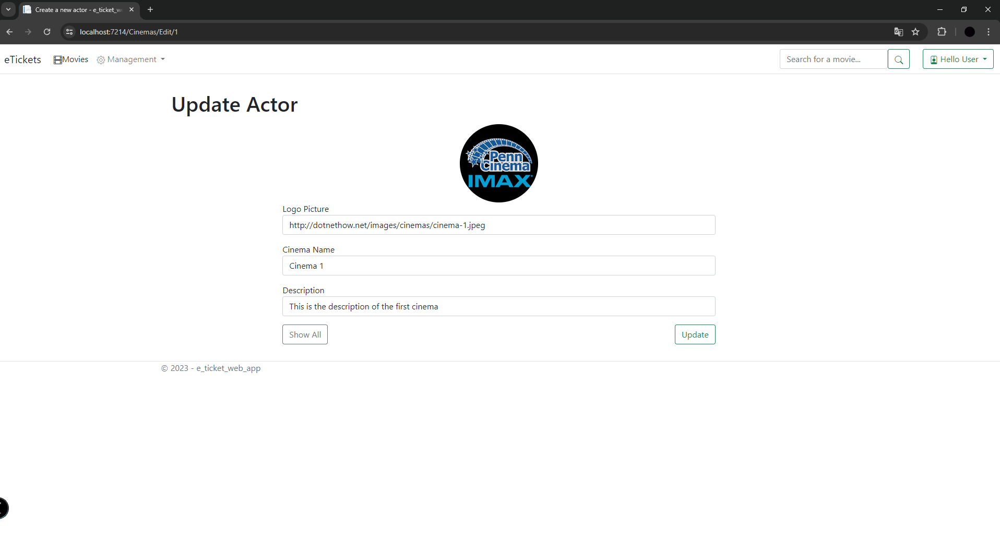

# Codeblogger Admin Panel

The project I developed using ASP.NET Core 7.0 uses MVC architecture. Entity Framework Code First was used for dynamic database management. The N-Layer architectural structure was implemented in the project, giving priority to making the code more modular and sustainable.

## Technologies Used

- ASP.NET Core 7.0
- MSSQL
- Identity
- Entity Framework Code First
- HTML
- CSS
- JavaScript
- Bootstrap

